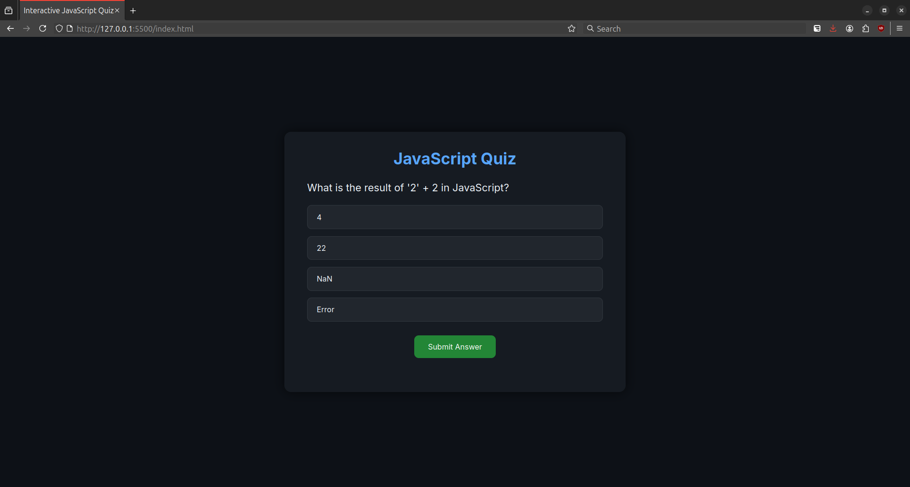
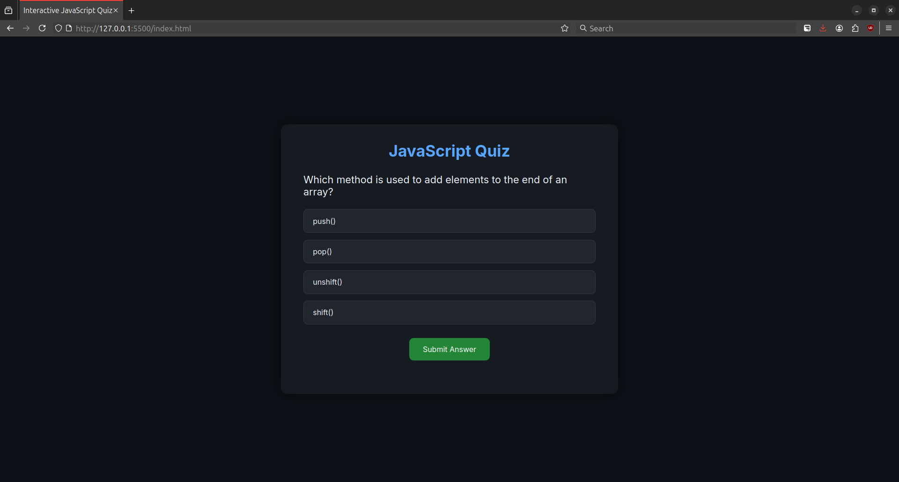

# INTERACTIVE_QUIZ_CODETECH

## 🏢 Internship Details

- **Company:** CODTECH IT Solutions  

- **Name:** Saketi Jayanthkumar 

- **Intern ID:** :CT04DG107

- **Domain:** Front-End Development  

- **Duration:** 4 Weeks

- **Mentor:** Neela Santhosh

# 💡 Interactive JavaScript Quiz App

A modern, sleek, and fully responsive quiz web application developed using HTML, CSS, and Vanilla JavaScript. This project is designed to provide users with an engaging and interactive experience as they test their knowledge of JavaScript fundamentals.

The application features a set of carefully crafted multiple-choice questions that cover various JavaScript concepts — from basic syntax to more advanced logic and behavior. It not only tracks the user's score in real-time but also highlights correct and incorrect answers, providing an insightful summary at the end of the quiz. Users can review their mistakes, learn from them, and retry the quiz to improve their understanding.

The UI is built with a clean and elegant dark theme, optimized for desktop, ensuring an accessible and visually appealing experience across screen.

---

## 🧠 What I Learned

This project was a fun and insightful exercise where I:

- ✅ Practiced **DOM manipulation** and event handling in JavaScript
- ✅ Designed a **clean, modern dark UI** using only **CSS**
- ✅ Built logic for:
  - Dynamically loading questions
  - Managing answer selection
  - Tracking scores and displaying results
- ✅ Understood how to **structure code** across HTML, CSS, and JS for maintainability
- ✅ Learned how to create **user-friendly interfaces** with hover effects, visual feedback, and animations

---

## 🛠️ Tech Stack

| Technology     | Purpose                           |
|----------------|-----------------------------------|
| **HTML5**      | Structure of the app              |
| **CSS3**       | Styling and responsive design     |
| **JavaScript** | App logic and interactivity       |
| **Google Fonts** | Custom font for elegant UI     |
| **VS Code + Live Server** | Local development & testing |

---

## ✨ Features

- 🎯 Interactive and dynamic quiz system
- 🌑 Sleek **dark mode** theme for better UX
- 📈 Score tracking with percentage output
- ✅ Color-coded answers (correct vs wrong)
- 📝 **Review section** showing wrong answers with corrections
- 💻 Fully **responsive design**
- ⚡ Smooth UI animations
- 🔄 Restart-friendly logic (easy to extend)

---

## 🧪 How To Use

1. 📥 Clone or download the repository
2. 📂 Open the folder in [Visual Studio Code](https://code.visualstudio.com/)
3. 🖱️ Right-click on `index.html` and choose **“Open with Live Server”**
4. 🧠 Take the quiz and see your results instantly!

---

## 🛣️ Roadmap / Future Enhancements

Here are a few features I'd like to add going forward:

- [ ] 🎮 Add a **start screen** with a "Start Quiz" button
- [ ] ⏱ Add **per-question timer**
- [ ] 🔁 Enable **quiz restart** with a "Try Again" button
- [ ] 🔀 Shuffle questions and choices for randomness
- [ ] 🌗 Toggle between **dark and light mode**
- [ ] 💾 Save high scores using `localStorage`
- [ ] 📱 Enhance mobile experience further with fluid layout

---

## 📌 Key Code Concepts Used

- DOM traversal and manipulation
- `addEventListener` for interaction handling
- Dynamic element creation (`document.createElement`)
- Array mapping and looping
- `innerHTML` updates for result rendering
- CSS flexbox and transitions
- Responsive design with media queries (optional)

---

## 📸 Screenshot

